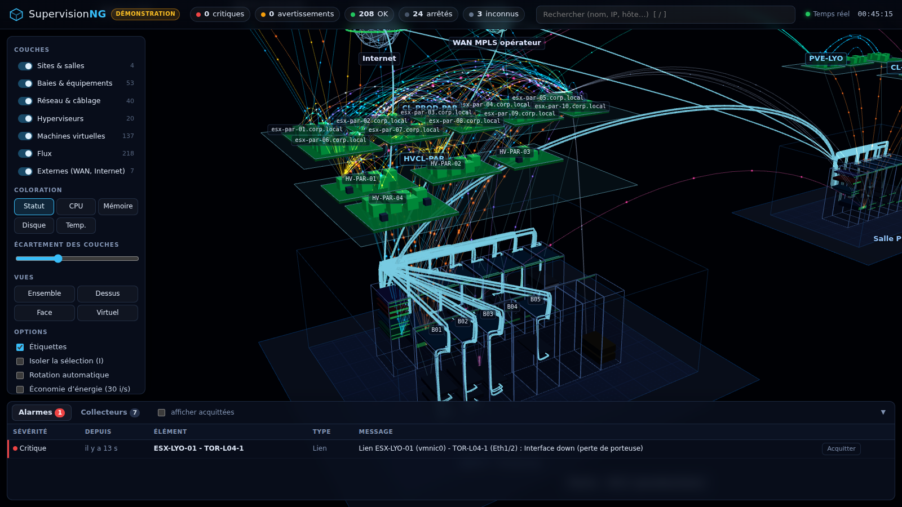
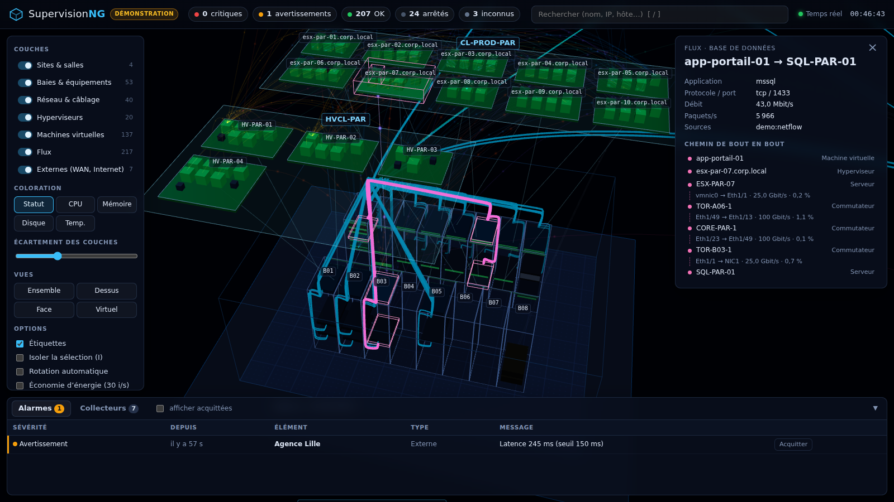

# SupervisionNG

**Une vue 3D unique et intégrale de l'infrastructure** : salles et baies physiques,
systèmes, réseau et câblage, hyperviseurs, machines virtuelles et flux applicatifs,
dans une seule scène navigable, mise à jour en temps réel. Fonctionne sous **Windows**
(serveur Node.js, sans compilation ; affichage dans Edge ou Chrome).



## Ce que montre la vue

| Couche | Représentation |
|---|---|
| **Sites & salles** | sites côte à côte, salles avec faux-plancher, rangées en allées chaudes / froides |
| **Baies & équipements** | baies 42U, serveurs, stockage, onduleurs à leur position U réelle ; voyant d'état en façade |
| **Réseau & câblage** | commutateurs, routeurs, pare-feu, répartiteurs ; câbles réels (inventaire + LLDP) colorés selon l'utilisation |
| **Hyperviseurs** | plateaux regroupés en îlots par cluster, au-dessus des baies, reliés au serveur physique qui les porte |
| **Machines virtuelles** | un cube par VM (prisme hexagonal pour un conteneur) posé sur son hyperviseur |
| **Flux** | arcs animés entre VM, serveurs et externes ; densité = débit, couleur = type d'application |
| **Externes** | Internet, WAN, agences, cloud (Microsoft 365…) avec leurs liens et leur latence |

Fonctions principales :

- **Corrélation multi-sources** : un même serveur vu par l'inventaire, Hyper-V, WinRM et SNMP
  devient une seule entité (clés : nom d'hôte, n° de série, UUID, MAC) ; les flux NetFlow,
  qui ne contiennent que des adresses IP, sont rattachés automatiquement aux VM.
- **Traçage de chemin** : un clic sur un flux affiche son trajet physique réel,
  VM → hyperviseur → serveur → carte réseau → ToR → cœur → … → VM, avec les ports, débits
  et taux d'utilisation de chaque lien traversé.
- **Alarmes** : seuils (CPU, mémoire, disque, température, latence, utilisation des liens),
  états remontés par les collecteurs, colonnes lumineuses au-dessus des baies en défaut,
  acquittement.
- **Coloration** par statut ou en carte de chaleur (CPU, mémoire, disque, température).
- **Isolation** d'un élément et de tout ce qui lui est lié (touche `I`), recherche (`/`),
  écartement des couches, vues prédéfinies.
- **Mode mur d'écrans** (`?kiosk=1` ou touche `K`) : rotation automatique et passage en revue
  des alarmes, pour les écrans de salle de supervision.



## Démarrage rapide sous Windows

### Option 1 — paquet autonome (recommandé, sans installation)

1. Récupérer `SupervisionNG-x.y.z-win-x64.zip` (artefact **SupervisionNG-win-x64** de la
   CI GitHub Actions, ou `npm run package:win -- --with-node` sur un poste de build).
2. Décompresser, par exemple dans `C:\SupervisionNG`.
3. Double-cliquer sur **`SupervisionNG.cmd`**.

Le paquet embarque `node.exe` et toutes les dépendances : aucun accès Internet n'est nécessaire.

### Option 2 — depuis les sources

Prérequis : [Node.js 20 LTS ou plus récent](https://nodejs.org).

```bat
git clone <ce dépôt> C:\SupervisionNG
cd C:\SupervisionNG
npm ci
SupervisionNG.cmd
```

Sans fichier `config\supervisionng.json`, SupervisionNG démarre en **mode démonstration** :
deux datacenters simulés (Paris et un site de secours à Lyon), environ 140 VM sur VMware,
Hyper-V et Proxmox, un réseau complet, des flux applicatifs et des incidents
(panne d'hôte avec redémarrage HA des VM, lien coupé, saturation, attaque DDoS, surchauffe
de baie…). La vue s'ouvre sur <http://localhost:8080>.

Options de ligne de commande :

```
node server\index.js [--config fichier] [--demo] [--port 8080] [--host 0.0.0.0] [--open]
```

## Passer sur l'infrastructure réelle

1. **Configuration** : copier `config\supervisionng.example.json` en `config\supervisionng.json`,
   activer les collecteurs voulus (`"enabled": true`) et renseigner les cibles.
2. **Inventaire physique** : copier `config\inventory.example.json` en `config\inventory.json`
   et décrire sites, salles, rangées, baies et positions U. C'est la seule information qui ne
   se découvre pas ; le reste (VM, hyperviseurs, voisins réseau, flux) est collecté. Le fichier
   est relu automatiquement à chaque modification.
3. **Secrets** : ne pas laisser de mot de passe en clair. Deux possibilités :
   - `"password": "env:SNG_VCENTER_PASSWORD"` (variable d'environnement) ;
   - `"password": "dpapi:..."`, valeur produite par
     `powershell -ExecutionPolicy Bypass -File scripts\protect-secret.ps1` (chiffrement DPAPI
     lié à la machine).
4. **Service Windows** : dans une console PowerShell **administrateur**,
   ```powershell
   powershell -ExecutionPolicy Bypass -File scripts\install-service.ps1 -OpenFirewall -NetFlowPort 2055
   ```
   crée une tâche planifiée lancée au démarrage (redémarrage automatique en cas d'arrêt),
   sous le compte `SYSTEM` ou un compte de service (`-User DOMAINE\svc-supervision`).
   Journal : `logs\supervisionng.log`. Désinstallation : `scripts\uninstall-service.ps1`.
5. Pour afficher la vue depuis d'autres postes : `"server": { "host": "0.0.0.0" }`, et de
   préférence `"auth"` (authentification) et `"https"` (certificat `.pfx`).

## Collecteurs

| Type | Source | Ce qui est collecté | Prérequis |
|---|---|---|---|
| `inventory` | `config\inventory.json` | sites, salles, baies, positions U, câblage déclaré, externes | — |
| `windows` | CIM / WinRM (PowerShell) | OS, CPU, mémoire, disques, services automatiques arrêtés, IP/MAC ; connexions TCP → flux (`"flows": true`) | WinRM (TCP 5985/5986) ; droits de lecture CIM (administrateur local ou *Remote Management Users* + droits WMI) |
| `hyperv` | PowerShell Hyper-V / WinRM | hôtes, matériel, cluster, VM (état, CPU, mémoire, réseaux, VLAN, réplication) | module Hyper-V (RSAT) sur le serveur SupervisionNG ; compte membre de *Hyper-V Administrators* |
| `vsphere` | API REST vCenter | clusters, ESXi, VM, identité invité ; CPU/mémoire via VI/JSON | vSphere 7+ (métriques : 8.0U1+) ; rôle lecture seule ; TCP 443 |
| `proxmox` | API Proxmox VE | nœuds, VM QEMU, conteneurs LXC, stockages, MAC/VLAN | jeton d'API avec rôle *PVEAuditor* ; TCP 8006 |
| `snmp` | SNMP v2c / v3 | système, interfaces et débits (IF-MIB), n° de série (ENTITY-MIB), **voisins LLDP → câblage automatique** | UDP 161 ; vues SNMPv2-MIB, IF-MIB, ENTITY-MIB, LLDP-MIB |
| `netflow` | NetFlow v5 / v9 / IPFIX | flux (conversations, débits), rattachés aux VM par IP | exporter depuis routeurs / pare-feu / switches vers UDP 2055 ; règle de pare-feu entrante |
| `ping` | ICMP | disponibilité et latence de tous les équipements connus ayant une IP | ICMP autorisé sur les cibles |
| ingestion | `POST /api/ingest/<source>` | tout ce qu'un script ou un autre outil veut pousser | voir [docs/API.md](docs/API.md) |

Le format de données commun à tous les collecteurs, et la façon d'en écrire un nouveau,
sont décrits dans [docs/COLLECTEURS.md](docs/COLLECTEURS.md).

### Comment les sources sont fusionnées

Chaque collecteur publie ce qu'il voit avec des **clés de corrélation**. Deux entités de
même classe (physique, hyperviseur, VM) partageant une clé forte — `host:` (nom d'hôte court),
`fqdn:`, `serial:`, `uuid:`, `mac:` — sont fusionnées. L'inventaire a la priorité pour le nom
et la position ; l'état retenu est le pire des états remontés ; les métriques les plus
récentes l'emportent. Un collecteur d'hyperviseur publie trois niveaux (serveur physique →
hyperviseur → VM), ce qui place automatiquement chaque VM au-dessus de la baie qui l'héberge.
Un équipement découvert mais absent de l'inventaire apparaît dans la zone
« Équipements non positionnés ». Les données d'une source qui ne répond plus sont
signalées obsolètes (état inconnu) au bout d'environ trois intervalles de collecte.

## Utilisation de la vue

| Action | Souris / clavier |
|---|---|
| Tourner / déplacer / zoomer | clic gauche / clic droit (ou Maj + clic) / molette |
| Sélectionner, détails | clic sur un équipement, une VM, un câble, un flux ou une étiquette |
| Centrer sur la sélection | double-clic ou `F` |
| Tracer le chemin d'un flux | clic sur un flux dans la scène ou dans le panneau de détail |
| Rechercher (nom, IP, hôte…) | `/` |
| Afficher / masquer une couche | `1` à `7` |
| Changer de coloration | `C` |
| Isoler la sélection | `I` |
| Vue d'ensemble / de dessus | `R` / `T` |
| Mode mur d'écrans | `K` (ou URL `?kiosk=1`) |
| Désélectionner | `Échap` |

L'URL peut désigner un élément (`#sel=<id>`) et restreindre les couches
(`?layers=physical,network`) : pratique pour des favoris ou des écrans dédiés.

## Sécurité

- Écoute par défaut sur `127.0.0.1` ; ouvrir explicitement (`"host": "0.0.0.0"`).
- Authentification HTTP Basic (`server.auth`) et HTTPS (`server.https` avec un `.pfx`) intégrés.
- L'API d'ingestion exige un jeton (`server.ingestToken`) ; sans jeton, seuls les envois
  locaux sont acceptés.
- Les collecteurs ne font que de la **lecture** (CIM, API en lecture seule, SNMP GET).
- Les secrets se référencent par variable d'environnement ou par chiffrement DPAPI.
- Aucune ressource externe : three.js est servi localement, la vue fonctionne sur un réseau isolé.

## Architecture

```
SupervisionNG.cmd          lanceur Windows (double-clic)
server/
  index.js                 démarrage : configuration, collecteurs, serveur HTTP
  config.js                configuration JSONC + secrets (env:, dpapi:, file:)
  model/store.js           fusion multi-sources, seuils, alarmes, deltas temps réel
  model/inventory.js       inventaire physique -> entités
  collectors/              demo, inventory, windows, hyperv, vsphere, proxmox, snmp, netflow, ping
  http/app.js              API REST, flux SSE, fichiers statiques
scripts/ps/                scripts PowerShell des collecteurs Windows (ASCII, compatibles 5.1 et 7)
shared/                    modèle et graphe communs serveur / navigateur (calcul des chemins)
public/                    vue 3D (three.js, sans étape de build) et interface
config/                    exemples de configuration et d'inventaire
```

Dépendances : `three` (rendu 3D) et `net-snmp` (optionnelle, collecteur SNMP). Pas de base de
données : l'état est reconstruit en mémoire à partir des collecteurs ; l'historique des
métriques (≈ 1 h) sert aux mini-graphes.

## Développement

```bash
npm ci
npm test                 # tests unitaires et d'intégration (node:test)
npm run demo             # serveur en mode démonstration
npm run package:win -- --with-node   # paquet Windows autonome dans dist/
```

La CI GitHub Actions exécute les tests sous **Windows et Linux** (Node 20 et 22), lance les
scripts PowerShell réels sous Windows PowerShell 5.1, puis construit et vérifie le paquet
Windows autonome (artefact téléchargeable).

## Licence

MIT — voir [LICENSE](LICENSE).
