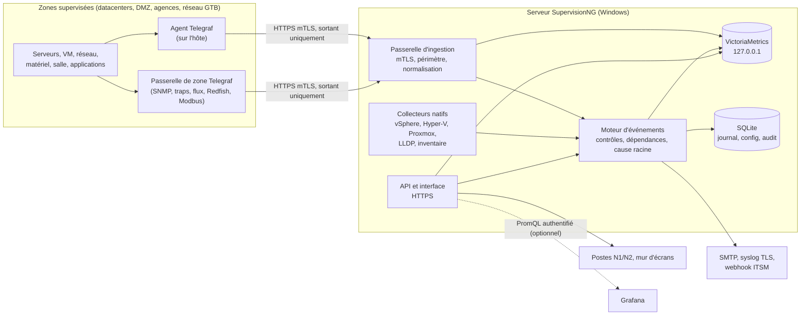

# Moteur de supervision : socle, collecte et sécurité

Ce document répond à une question posée après le conseil : faut-il bâtir le moteur sur une base existante (Prometheus ou autre), sachant que le backend doit être sécurisé et accepter la plupart des méthodes de remontée ? Il complète la [synthèse de la refonte](README.md).

## 1. Réponse courte

**Aujourd'hui (v0.1)**, SupervisionNG n'utilise aucune base existante. Les collecteurs sont écrits en Node.js, l'état vit en mémoire et l'historique ne couvre qu'une heure. Le conseil avait proposé un stockage SQLite écrit par nos soins.

**Recommandation** : on ne réécrit pas les briques de commodité, et on garde ce qui fait la valeur du produit.

| Rôle | Brique | Pourquoi |
|---|---|---|
| Collecte (agent et passerelle de zone) | **Telegraf** (MIT) | Un exécutable Windows, des centaines de plugins : SNMP v3, traps, NetFlow/IPFIX, sFlow, gNMI, Redfish, IPMI, WMI, journal d'événements, vSphere, bases de données, OTLP, Prometheus. Secrets lus dans le Gestionnaire d'identification Windows. |
| Séries temporelles | **VictoriaMetrics** single-node (Apache 2.0) | Un exécutable Windows, compatible Prometheus (PromQL, remote_write), lit aussi le protocole Influx de Telegraf et l'OTLP, très compact sur disque. Écoute uniquement sur `127.0.0.1`. |
| Moteur d'alarmes, topologie, corrélation, prise en charge | **SupervisionNG** | C'est la différence du produit : fusion multi-sources, dépendances, cause racine, traçage de chemin, vues. |
| Journal, configuration, utilisateurs, audit | **SQLite** (`node:sqlite`, Node 24 LTS) | Données relationnelles et transactionnelles, sans serveur à administrer. |

**Prometheus est compatible en entrée comme en sortie, mais il ne sert pas de socle.** On récupère les exporters Prometheus existants et on accepte `remote_write` et OTLP. On expose une API PromQL, ce qui permet d'y brancher Grafana si le client le souhaite.

## 2. Pourquoi pas Prometheus, Zabbix ou Centreon comme socle

| Candidat | Points forts | Ce qui bloque ici | Place retenue |
|---|---|---|---|
| **Prometheus** | standard des métriques, PromQL, écosystème d'exporters | Modèle en *pull* : il faut ouvrir un port entrant sur chaque cible, à travers les pare-feu. Pas de sous-échantillonnage, et 13 mois d'historique demandent Thanos ou Mimir, lourds et pensés pour Linux. Alertmanager regroupe et met en silence, mais ne connaît ni les dépendances topologiques ni la prise en charge nominative commentée. | compatibilité : exporters, `remote_write`, OTLP, API PromQL |
| **Zabbix** | supervision complète, agents, SNMP, IPMI | Le serveur et le proxy ne tournent que sous Linux ; sous Windows, seul l'agent existe. Cela contredit l'exigence « doit tourner sous Windows ». Il faut aussi administrer une base PostgreSQL ou MySQL. | import de ses états s'il est déjà en place (EXP-14) |
| **Centreon, Nagios, Checkmk** | catalogues de sondes éprouvés | serveur Linux uniquement | import de ses états |
| **OpenTelemetry Collector** | standard ouvert, tourne sous Windows | moins complet que Telegraf pour le réseau et le matériel (traps, Redfish, flux) | accepté en entrée (OTLP) |
| **Tout écrire nous-mêmes** (plan initial du conseil) | aucune dépendance | Réécrire des analyseurs de protocoles réseau (SNMP, NetFlow) coûte cher et élargit la surface d'attaque. | conservé en repli pour la démonstration et les petits sites, derrière l'interface `MetricStore` |

## 3. Architecture cible

**Chemin d'une mesure.**

1. Un agent ou une passerelle de zone l'envoie en HTTPS avec certificat client. Seuls des flux **sortants** vers le port 443 du serveur sont nécessaires : aucun port n'est ouvert sur les agents, et une seule règle de pare-feu suffit par zone.
2. La passerelle d'ingestion authentifie l'émetteur et vérifie qu'il n'écrit que pour son périmètre, puis normalise l'échantillon vers le modèle SupervisionNG.
3. Le moteur évalue l'échantillon au fil de l'eau (seuils avec durée et hystérésis), puis le transmet à VictoriaMetrics.
4. Les contrôles sur des agrégats (p95 horaire, plage normale, projection) interrogent VictoriaMetrics.

**Formats acceptés par la passerelle** : protocole Influx (sortie native de Telegraf), Prometheus `remote_write`, OTLP/HTTP et l'API JSON existante (`/api/ingest`).

**Rétention.** La version libre de VictoriaMetrics n'a qu'une rétention par instance et ne sous-échantillonne pas : ces fonctions sont réservées à l'édition Enterprise. On lance donc deux instances locales.

- Une instance **court terme** garde le brut à 1 min pendant 30 jours.
- Une instance **long terme** garde pendant 13 mois les agrégats à 15 min et à 1 h (moyenne, maximum et p95). Le moteur calcule ces agrégats sur le brut, jamais en moyennant des moyennes.

L'interface `MetricStore` isole ce choix : SQLite embarqué pour la démonstration et les petits sites, VictoriaMetrics par défaut, une autre base de séries chez un grand compte.

**Collecteurs natifs conservés.** Telegraf fournit des mesures, pas une topologie. L'inventaire, la fusion des sources, le câblage LLDP, les relations hôte → VM et le traçage de chemin restent dans SupervisionNG.

## 4. Méthodes de remontée et mode sécurisé exigé

Le mode « exigé » est celui de l'installation par défaut. Le mode « toléré » demande une dérogation explicite, tracée dans le journal d'audit et signalée dans l'interface.

| Domaine | Méthodes | Brique | Exigé | Toléré |
|---|---|---|---|---|
| Serveurs Windows | compteurs de performance, services, journal d'événements, WMI | agent Telegraf | agent sortant en mTLS | sans agent : CIM/WinRM en HTTPS (5986) avec Kerberos ; jamais Basic ni CredSSP |
| Serveurs Linux | CPU, mémoire, disques, processus, unités systemd ; exporters Prometheus en place | agent Telegraf | agent sortant en mTLS | collecte d'exporter via TLS et jeton |
| Hyperviseurs | API vSphere, Hyper-V (CIM), API Proxmox | collecteurs natifs, Telegraf pour les performances vSphere | HTTPS avec vérification du certificat, compte en lecture seule (rôle lecture seule vSphere, `PVEAuditor`) | certificat épinglé si l'autorité n'est pas reconnue |
| Réseau | SNMP en interrogation, traps et informs, LLDP, télémétrie gNMI | passerelle de zone Telegraf, collecteur LLDP natif | SNMPv3 authPriv (SHA-2, AES), gNMI en TLS | SNMP v2c en lecture seule, restreint par ACL au réseau d'administration |
| Flux | NetFlow v5/v9, IPFIX, sFlow | passerelle de zone Telegraf ou analyseur natif | ces protocoles UDP n'ont pas d'authentification : écoute sur l'interface d'administration et liste blanche des exportateurs | — |
| Matériel | Redfish, IPMI | Telegraf | Redfish en HTTPS, compte en lecture seule | IPMI en `lanplus` sur réseau hors bande isolé |
| Salle et énergie | PDU et onduleurs, climatisation et GTB | passerelle de zone Telegraf | SNMPv3 | Modbus TCP, non authentifié : seulement via une passerelle placée dans le réseau GTB |
| Journaux | syslog, journal d'événements Windows | Telegraf | syslog RFC 5424 sur TLS (RFC 5425) | syslog UDP sur réseau d'administration |
| Applications | sondes HTTP(S), TCP, DNS, ICMP ; échéance des certificats ; SQL Server, PostgreSQL, MySQL ; JMX ; OTLP | Telegraf | TLS, comptes en lecture seule | — |
| Autres outils de supervision | états Centreon et Zabbix, alertes Alertmanager | connecteurs SupervisionNG | API REST en HTTPS avec jeton en lecture seule, webhook authentifié | — |
| Scripts et outils maison | `POST /api/ingest/<source>` (existant) | SupervisionNG | mTLS ou jeton à portée et durée limitées | — |

## 5. Sécurité du backend

**Transport**
- HTTPS partout : TLS 1.3, et TLS 1.2 au minimum avec des suites fortes. HSTS sur l'interface.
- Le certificat vient de la PKI de l'entreprise (ADCS) ou d'une autorité interne générée à l'installation.

**Agents et passerelles**
- L'enrôlement se fait par jeton à usage unique, valable 24 h.
- La clé privée est générée sur l'agent et ne le quitte jamais.
- Le certificat client dure 90 jours, se renouvelle automatiquement et peut être révoqué.
- Chaque identité n'écrit que pour son périmètre : un agent compromis ne peut pas se faire passer pour un autre hôte.

**Identités et droits**
- Comptes d'annuaire via LDAPS ou Kerberos (authentification unique), ou fédération OIDC/SAML (ADFS, Entra ID, Keycloak).
- Comptes locaux en scrypt avec second facteur TOTP.
- Rôles lecteur, opérateur et administrateur, avec des périmètres par site ou par groupe.
- Jetons d'API à portée et durée limitées, verrouillage après plusieurs échecs.
- Aujourd'hui, la v0.1 n'a qu'un compte en authentification Basic.

**Secrets**
- Le chiffrement DPAPI déjà en place devient un coffre local chiffré.
- Telegraf lit ses secrets dans le Gestionnaire d'identification Windows.
- Aucun secret en clair dans la configuration ni dans les journaux.
- Un compte de collecte en lecture seule par domaine.

**Durcissement Windows**
- SupervisionNG devient un vrai service Windows sous le compte virtuel `NT SERVICE\SupervisionNG`. Aujourd'hui, c'est une tâche planifiée sous SYSTEM.
- Le dossier de données est protégé par ACL, avec un quota et une exclusion Defender.
- VictoriaMetrics et tous les ports internes n'écoutent que sur `127.0.0.1`.
- Le pare-feu n'ouvre que 443, plus au besoin les ports de réception syslog, traps et flux.

**Application web**
- Cookies de session `HttpOnly`, `Secure` et `SameSite=Strict`, jeton anti-CSRF.
- Politique CSP stricte, sans script en ligne, et en-têtes de sécurité.
- Limitation de débit.
- Validation stricte des entrées d'ingestion : taille, nombre de séries et étiquettes.

**Traçabilité**
- Le journal d'audit est en ajout seul, chaîné par empreintes. Il couvre connexions, prises en charge, maintenances, dérogations et changements de configuration.
- Il est exportable en syslog TLS vers le SIEM.

**Chaîne d'approvisionnement**
- Versions épinglées, empreintes SHA-256 vérifiées à la construction du paquet, SBOM CycloneDX.
- Binaires signés (Authenticode) si l'organisation fournit un certificat.
- Aucun téléchargement à l'exécution.
- Telegraf se compile avec les seuls plugins utiles, ce qui réduit sa taille et sa surface d'attaque.

**Principe conservé : lecture seule sur les cibles.** SupervisionNG n'exécute rien à distance. C'est un atout pour l'homologation.

## 6. Conséquences sur la feuille de route

L'étape 1 de la refonte 1 (« socle serveur ») devient :

1. Passer à Node 24 LTS : `node:sqlite` y est en release candidate.
2. Construire la passerelle d'ingestion en mTLS, avec enrôlement des agents.
3. Embarquer et piloter VictoriaMetrics (deux instances) et Telegraf.
4. Écrire le moteur d'événements et le journal SQLite.
5. Installer le service Windows sous compte virtuel.
6. Mettre en place l'authentification (annuaire, OIDC, comptes locaux) et les rôles (EXP-9).

Le paquet Windows embarque `node.exe`, `victoria-metrics.exe` et un `telegraf.exe` réduit, avec leurs empreintes vérifiées. Il reste installable hors ligne. La même architecture tourne aussi sous Linux si un site le préfère.
