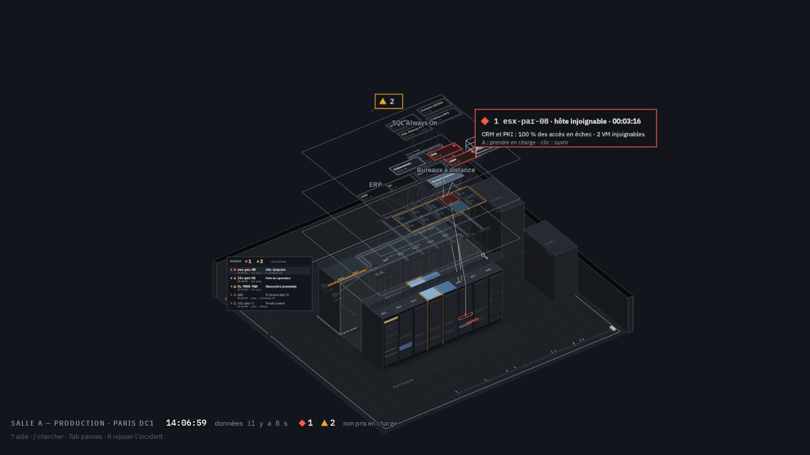
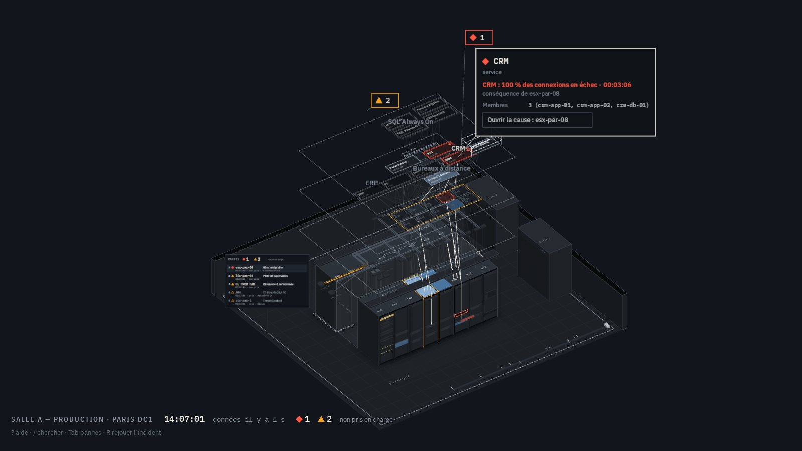
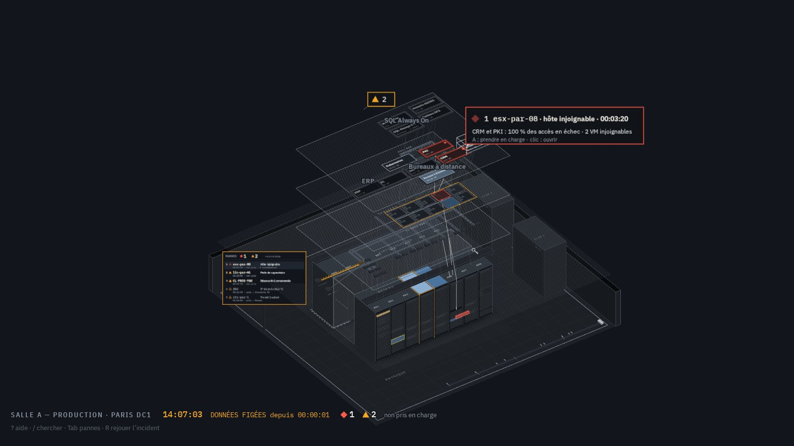
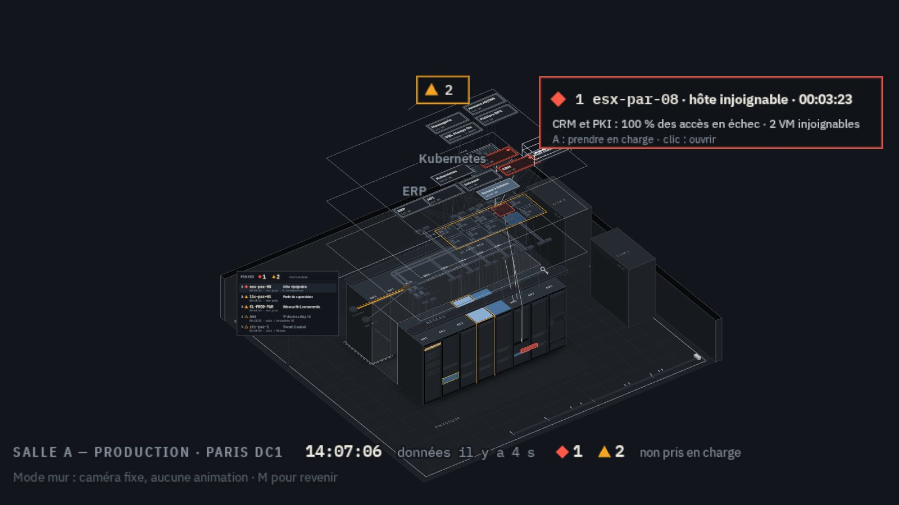

# Conseil de production — l'état global dans une console « tout en 3D »

Le client a posé trois exigences :

1. « Tout avoir de navigable sans interface en avant, que tout soit intégré dans l'espace 3D. »
2. « Si une panne survient, le visuel se meut pour mettre en évidence la panne sans perdre la vue globale.
   La complexité entre infrastructure physique et logique doit être résolue. »
3. « Montez un conseil d'experts de la production système, réseau et applicative : il sait ce qui compte
   sur une console sans envahir l'espace visuel. Par le mouvement, la couleur et l'intensité, il communique
   l'état global au-dessus des simples pannes. »

Le conseil réunit trois experts de production, chacun rompu aux environnements chargés et exigeants :

- système (virtualisation, stockage, énergie et climat) ;
- réseau (cœur, transit, WAN) ;
- applicatif (SLI, budgets d'erreur, déploiements).

Il a tenu deux tours sur la démo spatiale : un tour de propositions indépendantes, puis un tour de votes
sur dix questions (C1 à C10). Les comptes rendus complets sont dans [`conseil-production/`](conseil-production/).

Démo : `http://localhost:8080/refonte/spatial/` (voir [§ 7](#7-démo-spatiale)).

## 1. Ce que « l'état global » veut dire en production

Les trois experts posent la même question, chacun dans sa langue :

- **système** : « Quelle marge me reste-t-il avant la prochaine panne ? »
- **réseau** : « À combien de pannes suis-je de la coupure ? »
- **applicatif** : « Les usagers obtiennent-ils ce qu'ils viennent chercher, et cela va-t-il durer ? »

Une panne franche se voit toujours. Ce qui transforme une nuit calme en crise, c'est **une marge qui s'use
sans bruit** : un cluster qui a consommé sa réserve N+1, un transit à 81 % dont le jumeau ne tiendrait pas
la bascule, une salle qui chauffe, un datastore plein dans 24 jours, un budget d'erreur qui brûle 6,8 fois
trop vite. S'y ajoutent deux situations où la scène ment : **la supervision aveugle** (des données
périmées affichées en gris) et **le changement en cours** (qui ouvre la plupart des crises).

L'état global affiché, c'est donc la **marge**, la **confiance** qu'on peut avoir dans ce qu'on voit, et les
**interventions** en cours.

**À 4 h du matin, en 3 secondes, l'opérateur doit savoir trois choses** : y a-t-il un P1 non pris en charge ?
La scène vit-elle ? La redondance tient-elle ?

## 2. Ce que la console n'affiche pas

Les trois experts rejettent unanimement les éléments suivants :

- les jauges CPU et RAM par VM : 140 jauges qui ondulent sans décision à la clé ;
- les débits chiffrés sur les liens, qui restent dans le cartel ;
- les particules de trafic permanentes : un économiseur d'écran qui use le canal mouvement et le rendu à
  la demande ;
- les LED et les ventilateurs animés « pour montrer que ça vit » : trois semaines après, plus personne ne
  regarde un mur animé ;
- la routine : sauvegardes dans leur fenêtre, vMotion DRS, redémarrages planifiés, pods recréés ;
- les compteurs de vanité (« 1 247 contrôles OK »), les scores composites (« santé 87/100 ») et les
  moyennes de latence ;
- les P3 au mur, les alarmes filles (regroupées sous leur cause) et la rotation automatique de la caméra.

## 3. La grammaire : un canal visuel, un seul sens

Une scène saine est **immobile, opaque, doublée et sombre**. L'état global se lit dans les exceptions à
ces quatre qualités. La table est figée dans [`public/refonte/js/grammaire.js`](../../public/refonte/js/grammaire.js)
et un test vérifie qu'aucun canal ne porte deux sens.

| Canal | Sens unique | Paramètres |
|---|---|---|
| Élévation | niveau d'abstraction : physique, réseau, virtualisation, services | jamais une mesure |
| Teinte et forme | sévérité d'une alarme | ◆ P1 `#FF5A47`, ▲ P2 `#F5A524`, ○ P3 (absent du mur) ; ivoire = interaction et traçage ; violet = temps non réel |
| Clignotement carré 1 Hz | cause racine P1 non prise en charge | luminance 100 % ↔ 45 %, jamais éteint ; phases calées sur l'horloge murale ; cesse en moins de 100 ms à la prise en charge |
| Défilement orienté 0,5 Hz | trafic sorti de son régime (secours actif, flux hors fenêtre, paire déséquilibrée) | chevrons dans le sens du trafic, liens seulement, 8 au plus, expire après 10 min ou à la prise en charge |
| Double trait | redondance | double = tenue ; extérieur tireté = mince ; trait simple = perdue ; la plinthe de la salle reprend le pire |
| Luminance, 2 paliers de bleu | marge consommée | charge p95 (70 / 85 %), jours avant saturation (30 / 7 j), T° d'entrée (25 / 27 °C), contention (CPU ready 5 %), budget d'erreur (≥ 6×) ; hystérésis, fondu de 2 s |
| Hachure à 45° | inconnu | donnée périmée (3 intervalles), injoignable, perte de supervision ; **toute la salle si le moteur se tait plus de 30 s** |
| Glyphe statique | intervention en cours | échafaudage = changement, une graduation par instance mise à jour ; clé = maintenance déclarée |
| Atténuation (−30 % au plus) | mise en retrait pendant un focus demandé | objets nominaux seulement, sur poste, jamais par transparence ni au mur |

L'épaisseur (capacité nominale d'un lien) et la position appartiennent au dessin. Ce ne sont pas des canaux
d'état : elles ne bougent jamais.

Trois garde-fous accompagnent cette table :

- **Deux rythmes au plus**, de fréquences distinctes (1 Hz et 0,5 Hz). Au-delà, l'œil ne sépare plus les sens.
- **Achromatique d'abord.** Redondance, marge, inconnu et intervention se lisent sans la couleur : une
  capture en niveaux de gris raconte la même histoire (8 % des hommes sont daltoniens).
- **Lisible à 4 m.** Au mur, les traits font 3 px, les glyphes 32 px, et la luminance n'a que deux paliers.

## 4. Votes du tour 2

| # | Question | Système | Réseau | Applicatif | Décision |
|---|---|---|---|---|---|
| C1 | Changement en cours | échafaudage statique ; clé = maintenance | échafaudage ; clé = maintenance | clé ; avancement par instance | **Échafaudage** (changement, avancement par instance) et **clé** (maintenance), 2 contre 1 |
| C2 | Redondance | double trait partout, sans inclinaison | idem | idem (abandonne l'inclinaison) | **Unanime** |
| C3 | Luminance | marge consommée | idem ; un débit effondré est une alarme | idem ; débit métier bas = P2 | **Unanime** |
| C4 | Rythmes | deux | deux | trois (respiration 0,2 Hz pour le budget) | **Deux rythmes**, 2 contre 1 ; le budget d'erreur passe en luminance |
| C5 | Minimum ancré à l'écran | cartouche d'architecte dans un coin | légende en bas à gauche | cartouche, 2 % de l'écran au plus | **Unanime** : exception assumée au « sans surimpression » |
| C6 | Caméra sur poste | recadrage après 60 s sans manipulation | après 30 s | après 60 s, jamais pendant une sélection | **60 s**, 2 contre 1 ; « Entrée : cadrer » sinon ; jamais au mur |
| C7 | Tempête | plus de 3 nouvelles causes en 60 s ; au-delà de 7, agrégation | idem | idem, et aussi plus de 7 causes ouvertes | **Unanime**, avec les deux déclencheurs ; conséquences retenues 15 s, cause immédiate |
| C8 | Retour au calme | 5 min ; cicatrice de 30 min | idem | idem | **Unanime** |
| C9 | Estompage | −30 % de luminance, nominal seulement | opacité ≥ 70 % | −30 % de luminance | **Luminance**, 2 contre 1 ; la transparence n'a plus de sens attribué |
| C10 | Fraîcheur | hachure | hachure (retire son voile) | hachure | **Unanime** |

### Opinions dissidentes, consignées

- **Applicatif, C4.** Une respiration à 0,2 Hz sur les services qui brûlent leur budget se distingue d'un
  clignotement et d'un défilement. Ses garde-fous : expiration à 10 min et plafond de 5 % de l'écran en
  mouvement. À réexaminer si les opérateurs ne voient pas le palier de luminance du budget.
- **Applicatif, C1.** Préférait la clé seule, déjà au vocabulaire. L'échafaudage l'emporte : il porte
  l'avancement par instance et laisse la clé à la maintenance.
- **Réseau, C6.** Recadrage après 30 s : « un recul qui englobe la salle ne désoriente pas ». Rejeté, car un
  N1 qui lit un cartel reste souvent immobile plus de 30 s.
- **Réseau, C9.** Estompage par l'opacité, pour laisser la luminance à la marge. Rejeté : la transparence
  triée coûte au GPU intégré et brouille les strates. L'atténuation ne touche que les objets nominaux, déjà
  gris, et ne peut donc pas se confondre avec le bleu de marge.

## 5. Chorégraphie de panne : le visuel se meut sans perdre la salle

Le premier concept empilait cinq mouvements simultanés (impulsion, strates, caméra, tiroir, estompage). Au
pire moment, l'opérateur y perdait ses repères. Le conseil ne garde que des mouvements **uniques, courts et
sans rotation** :

| Mouvement | Quand | Durée | Jamais |
|---|---|---|---|
| Une onde au sol, un seul anneau | naissance d'une cause P1 | 1 000 ms | au mur, en tempête |
| Écartement des strates | premier P1 | 400 ms | va-et-vient : refermées 5 min après la dernière résolution |
| Tiroir : le serveur fautif sort de sa baie | cause P1 sur un équipement | 350 ms | au mur (une épingle le remplace) |
| Traçage ivoire fin de la chaîne, du sol aux services | sélection ou cause focalisée | immédiat | en rouge : seule la cause racine est rouge |
| Recul de la caméra : toute la salle et les colonnes des causes P1 | 60 s sans manipulation | 400 ms | pendant une sélection, au mur, avec rotation |
| Cicatrice : contour gris clair sur l'objet rétabli | résolution | 30 min | — |

En **tempête** (plus de 3 nouvelles causes en 60 s, ou plus de 7 ouvertes), les animations sont suspendues.
Le totem affiche « cause commune probable » et seules les causes racines restent dessinées.

La **prise en charge** calme la scène d'un cran. Le clignotement cesse, la cause passe au contour et quitte
les compteurs « non pris ».

## 6. Critiques du rendu, corrigées dans la démo

| Critique | Correction |
|---|---|
| Un faisceau rouge du sol au ciel colorait la strate réseau, hors de cause | Traçage ivoire fin ; le rouge reste sur l'équipement fautif |
| Cartels superposés : « Prendre en charge » était masqué | Un seul cartel ouvert à la fois ; les autres deviennent des épingles numérotées ; anti-chevauchement |
| « Prendre en charge » proposé sur le CRM, simple conséquence | On prend en charge la cause ; une conséquence propose « Ouvrir la cause » |
| Totem incliné, texte d'environ 7 px, P3 compris | Totem opaque, face caméra, 5 lignes P1 et P2, numérotées comme les épingles |
| Quatre plans translucides empilés faisaient du moiré sur les baies | Strates en filets de contour, objets opaques |
| lic-par-01 en ambre plein | Hachuré : perte de supervision = inconnu |
| Strate services minuscule | Plaques plus grandes ; cartel formulé en usagers (« CRM : 100 % des connexions en échec ») |
| Repères de la règle au sol en ambre | Repères à l'encre ; violet en relecture seulement |
| Libellé de salle en double | Un seul libellé, dans la légende de coin |

## 7. Démo spatiale

Lancer la démonstration (`SupervisionNG.cmd` ou `npm run demo`), puis ouvrir
`http://localhost:8080/refonte/spatial/`. Elle fonctionne hors ligne. La page ne contient que la scène 3D.
Seule la **légende de coin** (heure, âge des données, P1 et P2 non pris) est fixée à l'écran, par
exception votée à l'unanimité : la vérité des données ne doit pas dépendre de l'endroit où regarde la caméra.

Dans le scénario, chaque canal a un exemple :

- **Clignotement** : esx-par-08, cause racine P1 (ses deux alimentations sont perdues).
- **Défilement** : le faisceau de la baie A08 (flux de sauvegarde hors fenêtre, 3,1 Gb/s).
- **Double trait** :
  - CL-PROD-PAR en trait simple : la réserve N+1 est consommée par la reprise HA ;
  - transit et onduleur voie B en tireté (redondance mince) ;
  - Portail, Bureaux à distance et Kubernetes sans réserve ;
  - la plinthe de la salle reprend le pire état.
- **Luminance** :
  - palier 1 : stockage plein dans 24 jours, A05 à 25,8 °C, contention d'esx-par-07 après la reprise ;
  - palier 2 : A04 à 28,4 °C, rtr-par-1 à 81 % au p95, budget des Bureaux à distance consommé 6,8 fois
    trop vite.
- **Hachure** : lic-par-01 (perte de supervision) et les VM injoignables. La touche G simule un moteur muet :
  toute la salle se hachure et l'horloge s'arrête en ambre.
- **Glyphes** : échafaudage sur le Portail (CHG-2291, 6 instances sur 10) et clé sur bkp-par-01 (maintenance).
- **Tempête et cicatrice** : T lance une tempête simulée sur le cœur de réseau ; T à nouveau la termine, et
  les équipements rétablis gardent un contour gris clair pendant 30 min.

Raccourcis de la démo :

| Touche | Action |
|---|---|
| Tab | parcourir les pannes |
| Entrée | cadrer ou ouvrir |
| A | prendre en charge |
| 1 à 4, 0 | isoler une strate, les montrer toutes |
| E | écarter les strates |
| H | vue globale |
| R | rejouer l'incident |
| L | revenir au direct |
| G | simuler un gel des données |
| T | simuler une tempête |
| M | mode mur |
| / | chercher |
| ? | aide |
| Échap | revenir |

Captures :

- 
- 
- 
- 

## 8. Suites à donner

Par ordre de priorité :

1. **Collecter les marges** : capacité HA, voies électriques, onduleurs, sondes, projections de
   saturation, CPU ready, budgets d'erreur. Sans elles, la grammaire n'a rien à encoder.
2. **Relier la démo au flux temps réel** (SSE) : l'âge des données et la hachure de gel deviennent réels.
3. **Journal des changements** (webhook CI/CD, calendrier ITSM), pour l'échafaudage et la clé.
4. **Tests à 4 m et en niveaux de gris** dans les critères de sortie.
5. **Revue hebdomadaire des alarmes chroniques.** Un jour normal, moins de 2 % d'objets colorés et aucun
   mouvement sans changement réel.
